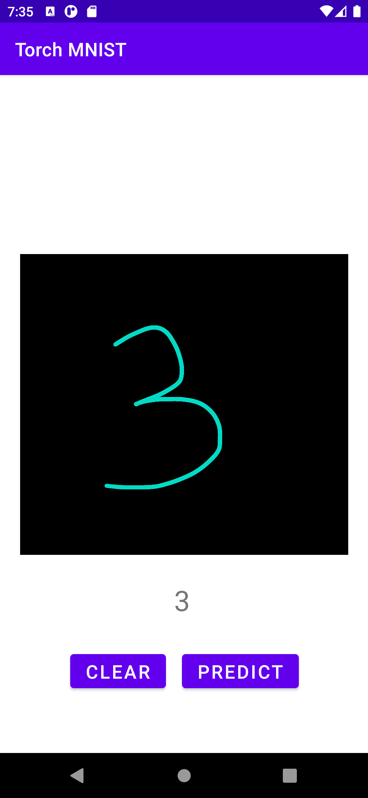

# PyTorch Mobile `mnist`
This is a simple (and not super functional) example of writing an Application for Android to perform 
hand-written digit prediction using the very popular MNIST dataset.
 

## `model`

## `android`

### Resources
- [Kotlin Training](https://developer.android.com/codelabs/advanced-android-kotlin-training-canvas?hl=en&continue=https%3A%2F%2Fcodelabs.developers.google.com%2F%3Fcat%3Dandroid#0)
- [constraintLayout](https://www.raywenderlich.com/9193-constraintlayout-tutorial-for-android-getting-started)
- [Google Constraint Layout](https://developer.android.com/training/constraint-layout)
- [PyTorch 1.9.0 Object Detection Example](https://github.com/pytorch/android-demo-app/blob/master/ObjectDetection/app/src/main/java/org/pytorch/demo/objectdetection/MainActivity.java)